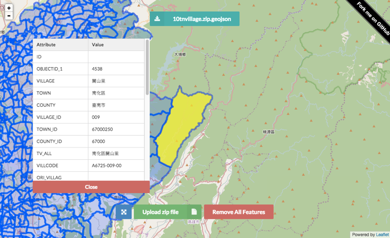

# shp2geojson.js
Convert shapefile to geoJSON via a web browser without Server-Side code. This conversion will unzip your file and reproject the data with correct encoding in JavaScript.

Inspired by this project by wavded http://github.com/wavded/js-shapefile-to-geojson

# Usage
Include all of the necessary files for the webpage to preview shp.

```
<script src="https://cdnjs.cloudflare.com/ajax/libs/proj4js/2.3.3/proj4.js"></script>
<script src="lib/jszip.js"></script>
<script src="lib/jszip-utils.js"></script>
<!--[if IE]>
<script type="text/javascript" src="lib/jszip-utils-ie.js"></script>
<![endif]-->

<script src="preprocess.js"></script>
<script src="preview.js"></script>
```

Load the ZIP archive that must contain the .shp and .dbf files and replace the .prj file of shapefile with EPSG code.

Two options available if you need to set the EPSG or encoding for best fit to your data.
You can skip EPSG code field if your ZIP archive contain the .prj file.

```JavaScript
loadshp({
    url: '/shp/test.zip', // path or your upload file
    encoding: 'big5' // default utf-8
    EPSG: 3826 // default 4326
}, function(geojson) {
    // geojson returned
});
```

#### Use with Leaflet.js
```JavaScript
var map = L.map('map').setView([ 0, 0 ], 10),
vector = L.geoJson().addTo(map);

L.tileLayer('http://{s}.tile.osm.org/{z}/{x}/{y}.png' , { maxZoom: 18}).addTo(map);

loadshp({
    url: '/shp/test.zip',
    encoding: 'big5',
    EPSG: 3826
}, function(data) {
    vector.addData(data);
    map.fitBounds(vector.getBounds()); 
});
```


#### Use with Google Maps API v3
```JavaScript
var map = new google.maps.Map(document.getElementById('map'), {
    zoom: 10,
    center: {lat: 0, lng: 0}
});

loadshp({
    url: '/shp/test.zip',
    encoding: 'big5',
    EPSG: 3826
}, function(data) {
    var bounds = new google.maps.LatLngBounds(),
    bbox = data.bbox;
    
    map.data.addGeoJson(data);
    bounds.extend(new google.maps.LatLng (bbox[1], bbox[0]));
    bounds.extend(new google.maps.LatLng (bbox[3], bbox[2]))
    map.fitBounds(bounds);
});
```
# Demo
http://gipong.github.io/shp2geojson.js/


Case 1 (Encoding: Big5)



Case 2 (Encoding: Shift_JIS)


# License
The MIT License (MIT)

Copyright (c) 2015 Gipong

Permission is hereby granted, free of charge, to any person obtaining a copy
of this software and associated documentation files (the "Software"), to deal
in the Software without restriction, including without limitation the rights
to use, copy, modify, merge, publish, distribute, sublicense, and/or sell
copies of the Software, and to permit persons to whom the Software is
furnished to do so, subject to the following conditions:

The above copyright notice and this permission notice shall be included in all
copies or substantial portions of the Software.

THE SOFTWARE IS PROVIDED "AS IS", WITHOUT WARRANTY OF ANY KIND, EXPRESS OR
IMPLIED, INCLUDING BUT NOT LIMITED TO THE WARRANTIES OF MERCHANTABILITY,
FITNESS FOR A PARTICULAR PURPOSE AND NONINFRINGEMENT. IN NO EVENT SHALL THE
AUTHORS OR COPYRIGHT HOLDERS BE LIABLE FOR ANY CLAIM, DAMAGES OR OTHER
LIABILITY, WHETHER IN AN ACTION OF CONTRACT, TORT OR OTHERWISE, ARISING FROM,
OUT OF OR IN CONNECTION WITH THE SOFTWARE OR THE USE OR OTHER DEALINGS IN THE
SOFTWARE.
